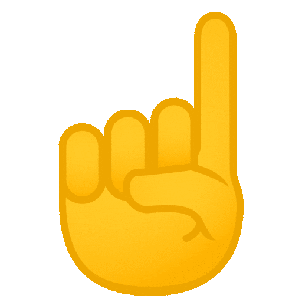

# 💼 Hola soy Vanessa Mery 👋

<picture></picture> **Sobre mi**

<picture> </picture>

 

- A passionate Self-taught Front-end developer
- Playing CTF's at spare time
- Currently learning Web Development by Self
- Personal website [link](https://www.0xabdulkhalid.ml)
- I’m currently open for an Intern or a new job opportunity, this is [my resume](https://read.cv/0xabdulkhalid)

  

  

## My tech stack

 

   
  &emsp;
   
  &emsp;
  
  &emsp;
  
  &emsp;
   
  &emsp;
  
  &emsp;
  
  &emsp; 
   
  &emsp;
   
  &emsp;
  
  &emsp;
  
  &emsp;
   
  &emsp;
  
  &emsp;
  

## 👩‍💻 Sobre mí

Soy **Vanessa Mery Sanchez Ticona**, Analista QA Automatizador. Egresada de la carrera de **Computación e Informática**, con pasión por la automatización de pruebas y optimización de procesos QA.

✨ Me destaco por ser:
- Proactiva
- Generosa
- Respetuosa
- Amante del trabajo en equipo
- Capaz de trabajar bajo presión y con alta capacidad de análisis

💡 Mi enfoque está en:
- Pruebas automatizadas
- Pruebas funcionales
- Pruebas unitarias
- Pruebas de regresión

---

## 🛠️ Tecnologías y Herramientas

Aquí algunas de las tecnologías que manejo:

  
  
  
  
  
  
  
  

---

## 📈 Proyectos y Experiencia

### 🏢 Cliente: Claro Perú

#### 🔹 Funciones destacadas:
- Estimación y ejecución de pruebas QA.
- Control de fallas y proyectos en **JIRA**.
- Revisión de documentos funcionales y técnicos: MDI, PDP, PS, EDS, EDD.
- Pruebas unitarias, funcionales y regresión en web, BD y servicios REST/SOAP.
- Automatización con **Selenium**, **SoapUI** y **Postman**.
- Reportes y documentación en RTC, checklist, SOX, entre otros.

---

## 🌐 Sitio Web

🔗 Puedes visitar mi portafolio online:  
👉 [https://VanessaSanchez1.github.io/portafolio-vanessa](https://VanessaSanchez1.github.io/portafolio-vanessa)

---

## 📬 Contáctame

---

📌 _Este repositorio forma parte de mi marca personal y es un reflejo de mi camino profesional como QA Automatizadora._
